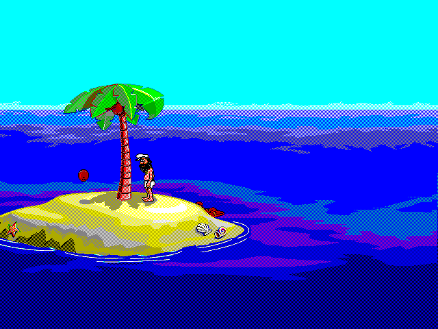

# Johnny Castaway libretro

Johnny Castaway libretro is an unofficial, portable C99 core for RetroArch. It
recreates the automatic story and all 63 selectable chapters from a legally owned
copy of *Screen Antics: Johnny Castaway*, with deterministic 640x480 software
rendering, audio, RetroPad input, Core Options, and versioned save states.

**[Project website](https://hunterdavis.com/johnny-castaway-retroarch/)** ·
**[Play in a browser](https://hunterdavis.com/johnny-castaway-retroarch/play/)** ·
**[Download v0.1.4](https://github.com/huntergdavis/johnny-castaway-retroarch/releases/tag/v0.1.4)**



## Highlights

- Automatic story playback and direct access to 63 chapters with live previews.
- Closed captions, simulated-calendar and deterministic-seed controls, holiday
  overlays, tide and raft controls, and 1x-4x playback.
- Optional user-supplied original sound effects plus separately licensed CC0 ocean
  ambience.
- Five scene-transition styles, persistent island walking and tree occlusion, and
  deterministic save-state restoration.
- A frontend-independent C99/libretro implementation with no SDL or window-system
  dependency.

## Required game data

The core requires `RESOURCE.MAP` and the matching `RESOURCE.001` from your own lawful
copy. Keep the two files together and load `RESOURCE.MAP` in RetroArch, or select both
files in the Web player. Supported sibling sound-effect WAVs are optional.

No Sierra/Dynamix game data, extracted artwork or animation, or original audio is
distributed by this project. The repository includes clearly attributed composite
screenshots solely to document the running port. The port is independent and is not
affiliated with or endorsed by Sierra, Dynamix, or their current rights holders.
Project code is GPLv3; third-party and media notices are included with each release.

## Build and test

Clone recursively, then build the native core and run the host regression suite:

```sh
git clone --recursive https://github.com/huntergdavis/johnny-castaway-retroarch.git
cd johnny-castaway-retroarch
./scripts/build-target.sh native
make test
```

The build is written below `build/` for the host platform. Cross-target names are
listed by `./scripts/build-target.sh --list`.

## Platforms and validation

Release artifacts cover Linux, Windows, Android, macOS, iOS, tvOS, and
Emscripten/Web. Direct installable frontend ZIPs are provided for PSP, Nintendo
Switch, Nintendo 3DS, GameCube, Wii, Wii U, PlayStation Vita/TV, and PlayStation 2.

Automated gates include strict host regression tests, a real native RetroArch smoke
test, target architecture and libretro export checks, a complete Web distribution and
real-browser acceptance tests, deterministic console archives, and console frontend
package, metadata, provenance, and no-original-data validation. The PSP package also
passes a pinned PPSSPP boot smoke test.

Console package validation proves compilation, frontend linkage, structure, identity,
and data hygiene. It does **not** claim physical-device validation of boot, rendering,
audio, input, performance, persistence, or save states; those remain per-device test
gates.

## Documentation

- [Web build, testing, and privacy](docs/WEB_TESTING.md)
- [Platform coverage and validation status](docs/PLATFORM_MATRIX.md)
- [Console installation and device-test boundaries](docs/INSTALLABLE_FRONTENDS.md)
- [Source and asset provenance](docs/PROVENANCE.md)
- [Credits and project lineage](CREDITS.md)
- [Release procedure](docs/RELEASING.md)

See [LICENSE](LICENSE) and [third-party notices](docs/THIRD_PARTY_NOTICES.md) for the
complete licensing terms.
